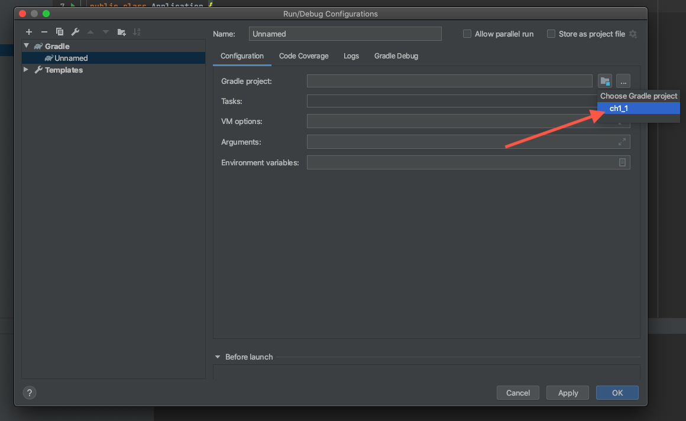

# SpringBootプロジェクトのローカル実行方法
1. IntelliJ右上の `Add Configuration...` をクリック

   

2. `Run/Debug Configurations` ウィンドウの左上付近の `+` をクリック

   

3. メニュー内の `Gradle` をクリック

   

4. `Gradle project` の右側のボタンを押下し、現在開いているプロジェクトの名前を選択

   

5. `Tasks` の入力欄に `bootRun` と入力

   

6. `OK`をクリックして設定を完了する

7. IntelliJ右上の `Add Configuration...` が `ch1_1 [bootRun]` のように変化していることを確認

8. 更にその右側の `▷` ボタンをクリック

   

